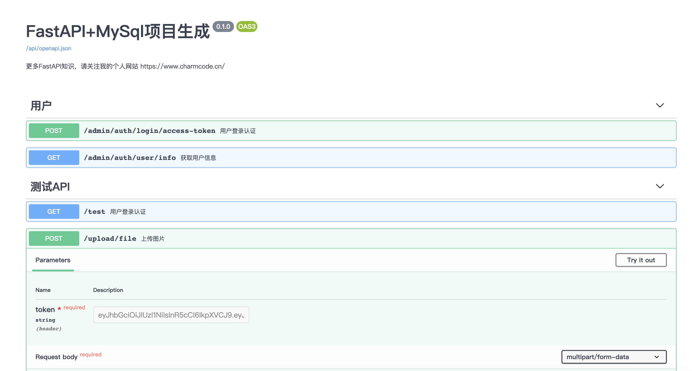

# FastAPI and MySql - 项目生成器


## Intro
使用FastAPI + MySql 作为数据库的项目生成器, 我是参考tianolo的full-stack-fastapi-postgresql项目做的。

https://github.com/tiangolo/full-stack-fastapi-postgresql

我把它改成了自己喜欢的格式。




## 特点
- JWT token 认证。
- 使用SQLAlchemy models(MySql).
- Alembic migrations 数据迁移.
- redis使用演示.
- 文件上传演示.


## 如何使用

进入你想要生成项目的文件夹下，并且运行以下命令。

```
pip install cookiecutter
cookiecutter https://github.com/CoderCharm/fastapi-mysql-generator

cd your_project/
pip install -r requirements.txt
```

## 配置你的数据库环境

在这个文件下 `project/app/core/config/development_config.py` 或者 `production_config.py`。

配置MySql和Redis信息(如果不需要redis可以去掉，然后在`/app/api/__init__.py`文件下注释`register_redis`函数)

## 迁移数据库

```
# 进入项目下
cd your_project/

# 生成关系映射
alembic revision --autogenerate -m "init commit"

# 生成表
alembic upgrade head
```

<details>
<summary>迁移由于项目路径可能失败</summary>

```python

# 在 alembic/env.py文件里面
import os,sys
BASE_DIR = os.path.dirname(os.path.dirname(os.path.abspath(__file__)))
print(f"当前路径:{BASE_DIR}")


sys.path.insert(0, BASE_DIR) 
# 如果还不行，那就简单直接点 直接写固定
# sys.path.insert(0, "/你的路径/you_project/") 

```
</details>

## 创建用户

```
cd your_project/app
python create_user.py
```

## 运行启动

```
# 进入项目文件夹下
cd your_project/app

# 直接运行main文件
python main.py

# 或者 命令行运行(开发模式)
uvicorn main:app --host=127.0.0.1 --port=8010 --reload
```

在线文档地址
```
http://127.0.0.1:8010/api/docs
```
