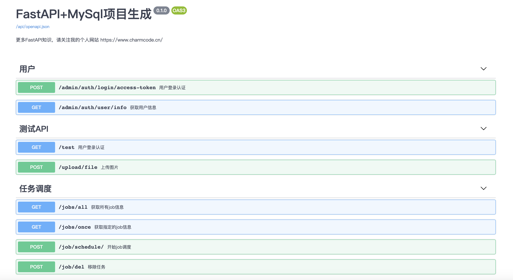

# FastAPI and MySQL - 项目生成器


[中文说明](./README.md) | [English](./README-en.md)

## 简介
使用FastAPI + MySql 作为数据库的项目生成器, 我是参考FastAPI作者[tiangolo](https://github.com/tiangolo)的 [full-stack-fastapi-postgresql](https://github.com/tiangolo/full-stack-fastapi-postgresql) 项目做的。

我把它改成了自己喜欢的格式。很大程度参考了[奇淼 gin-vue-admin项目](https://github.com/flipped-aurora/gin-vue-admin)




## 功能
- JWT token 认证。
- 使用SQLAlchemy models(MySql).
- Alembic migrations 数据迁移.
- redis使用演示.
- 文件上传演示.
- apscheduler 定时任务 (不保证稳定 noqa)
- 基于 casbin 的权限验证 (基于 [gin-vue-admin](https://github.com/flipped-aurora/gin-vue-admin) 复刻)

## TODO
- [ ] WebSocket 简单使用 ([个人练习的一个小demo](https://github.com/CoderCharm/chat))
- [ ] 异步ORM tortoise-orm  https://tortoise-orm.readthedocs.io/en/latest/examples/fastapi.html 
- [ ] aiocache 装饰器缓存(未实现) https://github.com/tiangolo/fastapi/issues/651

## 学习博客

<details>
<summary>项目学习博客点击展开</summary>

- [【FastAPI 学习 一】配置文件](https://www.cnblogs.com/CharmCode/p/14191077.html)
- [【FastAPI 学习 二】SqlAlchemy Model模型类](https://www.cnblogs.com/CharmCode/p/14191082.html)
- [【FastAPI 学习 三】FastAPI SqlAlchemy MySql表迁移](https://www.cnblogs.com/CharmCode/p/14191090.html)
- [【FastAPI 学习 四】日志配置](https://www.cnblogs.com/CharmCode/p/14191091.html)
- [【FastAPI 学习 五】统一响应json数据格式](https://www.cnblogs.com/CharmCode/p/14191093.html)
- [【FastAPI 学习 六】异常处理](https://www.cnblogs.com/CharmCode/p/14191103.html)
- [【FastAPI 学习 七】GET和POST请求参数接收以及验证](https://www.cnblogs.com/CharmCode/p/14191108.html)
- [【FastAPI 学习 八】JWT token认证登陆](https://www.cnblogs.com/CharmCode/p/14191112.html)
- [【FastAPI 学习 九】图片文件上传](https://www.cnblogs.com/CharmCode/p/14191116.html)
- [【FastAPI 学习 十】使用Redis](https://www.cnblogs.com/CharmCode/p/14191119.html)
- [【FastAPI 学习 十一】项目目录结构demo(自己改版)](https://www.cnblogs.com/CharmCode/p/14191126.html)
- [【FastAPI 学习 十二】定时任务篇](https://www.cnblogs.com/CharmCode/p/14191009.html)

</details>

## 项目文件组织

> 参考Django文件组织,FastAPI官方推荐项目生成,Flask工厂函数,[gin-vue-admin server文件组织](https://github.com/flipped-aurora/gin-vue-admin)

<details>
<summary>点击展开项目文件结构</summary>

```
.your_project
|__alembic                       // alembic 自动生成的迁移配置文件夹,迁移不正确时 产看其中的env.py文件
| |__versions/                   // 使用 alembic revision --autogenerate -m "注释" 迁移命令后 会产生映射文件
| |__env.py                      // 自动生成的文件
| |__script.py.mako
|__alembic.ini                   // alembic 自动生成的迁移配置文件

|____api                         // API文件夹
| |____v1                        // 版本区分
| | | |____items.py              // 一些接口示例
| | | |____sys_api.py            // API操作 用于权限管理
| | | |____sys_casbin.py         // 添加指定角色权限
| | | |____sys_scheduler.py      // 定时任务调度模块
| | | |____sys_user.py           // user 模块

| |____common                    // 项目通用文件夹
| | |______init__.py             // 导出日志文件方便导入
| | |____custom_exc.py           // 自定义异常
| | |____deps.py                 // 通用依赖文件,如数据库操作对象,权限验证对象
| | |____logger.py               // 扩展日志 loguru 简单配置
| | |____sys_casbin.py           // 生成 casbin
| | |____sys_scheduler.py        // 定义 apscheduler 在core/server 下初始化

|____core                        
| |____config                    // 配置文件
| | |______init__.py             // 根据虚拟环境导入不同配置
| | |____development_config.py   // 开发配置
| | |____production_config.py    // 生产配置
| |____celery_app.py             // celery (目前没有使用)
| |____security.py               // token password验证  
| |____server.py                 // 核心服务文件(重要) 初始化连接等操作
        
| |____db                        // 数据库
| | |____base.py                 // 导出全部models 给alembic迁移用
| | |____base_class.py           // orm model 基类
| | |____session.py              // 链接数据库会话
| | |____sys_redis.py            // 生成redis对象

|____logs/                       // 日志文件夹

| |____models                    // orm models 在这里面新增 (记得导入到 /db/base.py 下面才会迁移成功)
| | |____sys_api.py              // 项目API model
| | |____sys_auth.py             // 用户模块orm
         
| |____resource                  // 存放casbin model
| | |____rbac_model.conf         // casbin model匹配规则

| |____router                    // 路由模块
| | |____v1_router.py            // V1 API分组路由文件(可在这里按照分组添加权限验证)

| |____schemas                   // 请求 或者 响应的 Pydantic model(这里的schemas和model应该整合到一起 作者目前也写了一个 pydantic-sqlalchemy 互转的库 https://github.com/tiangolo/pydantic-sqlalchemy 但是感觉不太完善)
| | |____request                 // 数据验证 model 
| | |____response                // 数据响应 model(我项目里面暂时没有写响应model) 

| |____service                   // ORM 操作文件夹
| | |____curd_base.py            // curd通用基础操作对象
| | |____sys_user.py             // user curd操作

|____static/                     // 静态资源文件(测试时使用，生产建议使用nginx静态资源服务器或者七牛云)
         
|____tests/                      // 测试文件夹

| |____utils                     // 工具类
| | |____cron_task.py            // 定时任务task文件
| | |____tools_func.py           // 序列化orm特殊时间(但是感觉不太优雅)

|____jobs.sqlite                 // 定时任务持久化sqlite 也可以使用其他的比如redis
|____main.py                     // 启动文件
|____init_db.py                  // 生成初始化角色和用户
|____requirements.txt            // 依赖文件

```

</details>


## 如何使用

进入你想要生成项目的文件夹下，并且运行以下命令。

```
pip install cookiecutter
cookiecutter https://github.com/CoderCharm/fastapi-mysql-generator

cd your_project/
# 安装依赖库
pip install -r requirements.txt

# 建议使用 --upgrade 安装最新版 (windows系统下uvloop当前版本可能有问题  https://github.com/MagicStack/uvloop/issues/14)
pip install --upgrade -r requirements-dev.txt
```

## 配置你的数据库环境

在这个文件下 `project/app/core/config/development_config.py` 或者 `production_config.py`。

配置MySQL和Redis信息

## 迁移数据库

```
# 进入项目下
cd your_project/

# 生成关系映射 (第二次生成映射记得修改提交注释 init commit)
alembic revision --autogenerate -m "init commit"

# 生成表 (注意初次生成表会删除其他的表 建议在一个空数据库测试)
alembic upgrade head
```

<details>
<summary>迁移由于项目路径可能失败</summary>

```python

# 在 alembic/env.py文件里面
import os,sys
BASE_DIR = os.path.dirname(os.path.dirname(os.path.abspath(__file__)))
print(f"当前路径:{BASE_DIR}")


sys.path.insert(0, BASE_DIR) 
# 如果还不行，那就简单直接点 直接写固定
# sys.path.insert(0, "/你的路径/you_project/") 

```
</details>

## 创建用户
> 会默认创建两个角色一个为超级管理员角色，一个为普通角色，
超级管理员拥有目前接口的所有调用权限，普通用户只能登录和获取自身用户信息.
```
cd your_project/
python init_db.py
```

## 运行启动

```
# 进入项目文件夹下
cd your_project/

# 命令行运行(开发模式)
uvicorn main:app --host=127.0.0.1 --port=8010 --reload

# 直接运行main文件(会打印两次路由)
python main.py
```

<details>
<summary>可能会出现的常见路径倒入问题</summary>

```
# 如下两种解决方式

# pycharm中设置 标记为sources root
https://www.jetbrains.com/help/pycharm/configuring-content-roots.html#specify-folder-categories

# 命令行中标记为 sources root
https://stackoverflow.com/questions/30461982/how-to-provide-make-directory-as-source-root-from-pycharm-to-terminal

```
</details>

在线文档地址(在配置文件里面设置路径或者关闭)
```
http://127.0.0.1:8010/api/docs
```

## 接口测试

需要安装

```shell
pip install pytest
```

在项目下 启动测试用例
```
cd your_project/
pytest
```


## 部署

部署的时候，可以关闭在线文档，见学习文章一配置篇。

```shell
在main.py同文件下下启动 去掉 --reload 选项 增加 --workers
uvicorn main:app --host=127.0.0.1 --port=8010 --workers=4

# 同样可以也可以配合gunicorn多进程启动  main.py同文件下下启动 默认127.0.0.1:8010端口 gunicorn需要安装
# 参考http://www.uvicorn.org/#running-with-gunicorn
gunicorn main:app -w 4 -k uvicorn.workers.UvicornWorker -b 127.0.0.1:8010
```
<details>
<summary>点击查看托管到后台运行</summary>
  
```shell
# 1 如果为了简单省事 可以直接使用 nohup 命令 如下: run.log文件需要自行创建
nohup /env_path/uvicorn main:app --host=127.0.0.1 --port=8010 --workers=4 > run.log 2>&1 &

# 2 可以使用supervisor托管后台运行部署, 当然也可以使用其他的
# supervisor可以参考我总结的文章 https://www.cnblogs.com/CharmCode/p/14210280.html
```
</details>
